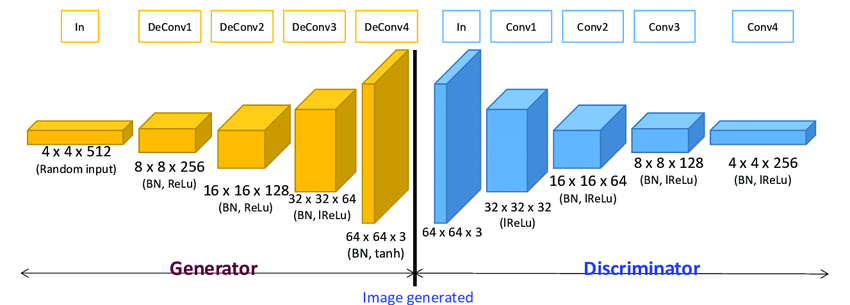
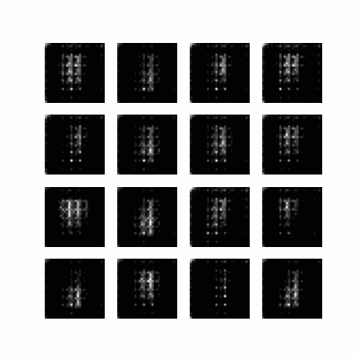
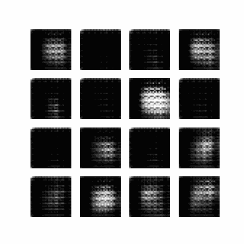
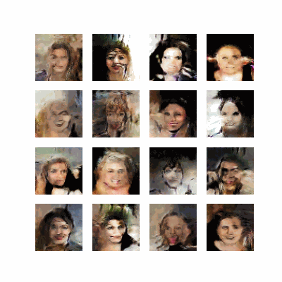

# DCGAN (Generative Adversarial Network)


A simple GAN and a DCGAN are similar in that they both use a generative and a discriminative models , to generate synthetic images.


A simple GAN uses __fully-connected__ layers in both G and D, whereas a DCGAN uses convolutional layers. This means that a DCGAN is able to capture spatial dependencies in the data, which can improve the quality of the generated images.


DCGAN is typically trained using batch normalization and __transposed convolutional layers__, which can stabilize the training process and improve the performance of the generative model.


<br>

# How to install :
```
pip install -r requirements.txt
```

<br>
<br>


# Results :

## 1_ MNIST :



## 2_ Deep Convolutional GAN on FASHION-MNSIT dataset :





## 3_ Deep Convolutional GAN on Celeb_A dataset :

